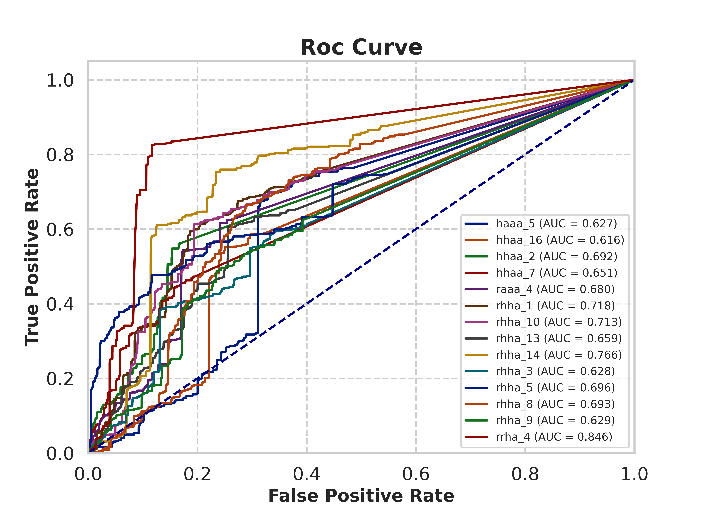

# Molph4
##Automated Validation pharmacophore model
- This package use results from MOE pharmacophore model screening (*txt, *csv)
- Automation select best pharmacophore model to optimize

## Requirements

This module requires the following modules:

- [RDkit](https://www.rdkit.org/)
- [scikit-learn](https://scikit-learn.org/stable/)

## Installation
To do...
## Usage

```python
import numpy as np
import pandas as pd
import matplotlib.pyplot as plt
import sys
sys.path.append('./Ph4')
from Postprocessing import pharmacophore_postprocess
from Validation import pharmacophore_validation
from Autoresult import autoph4result
import warnings
warnings.filterwarnings('ignore')

# 0. Database: dekois is data before screening through pharmacophore model
dekois = pd.read_csv("DEKOIS_data.csv").drop(['Unnamed: 0'], axis = 1)
data = pd.read_csv("./Data/cover9/haaa_1.txt")

# 1. Postprocess
postprocess = pharmacophore_postprocess(data = data, model ='haaa_1', ID = 'ID', ref=dekois, 
                                 scores = 'rmsd', rescore = 'minmax')
postprocess.fit()
postprocess.df

# 2. Validation
ph4 = pharmacophore_validation(data = postprocess.df, active = "Active", predict = "predict",
                               scores = "haaa_1_rescore", model ='haaa_1', auc_thresh = 0.5, plottype='auc', figsize =(8.5,5))
ph4.validation()
ph4.table.head()

# 3.Automation pharmacophore validation
import os
dekois =  pd.read_csv('DEKOIS_data.csv').drop(['Unnamed: 0'], axis = 1)
path = os.getcwd() + '/Data/'
auto = autoph4result(path = path, ref=dekois, scores = 'rmsd', active = 'Active', ID = 'ID', 
                     rescore = 'minmax', auc_thresh = 0.6, figsize = (9,5))
auto.compare_model_multi()

```
